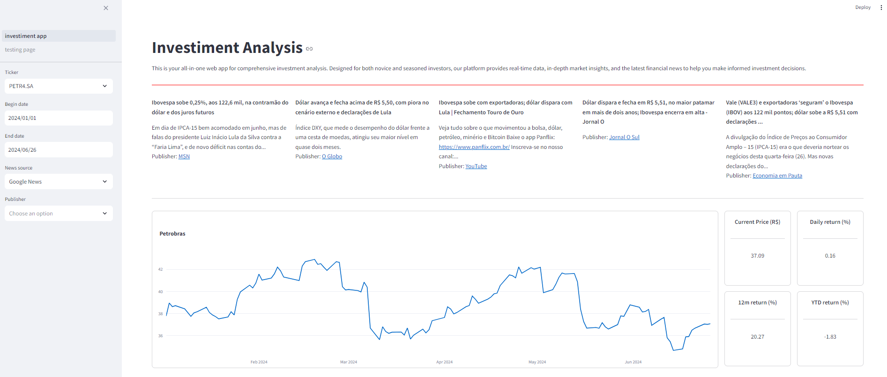
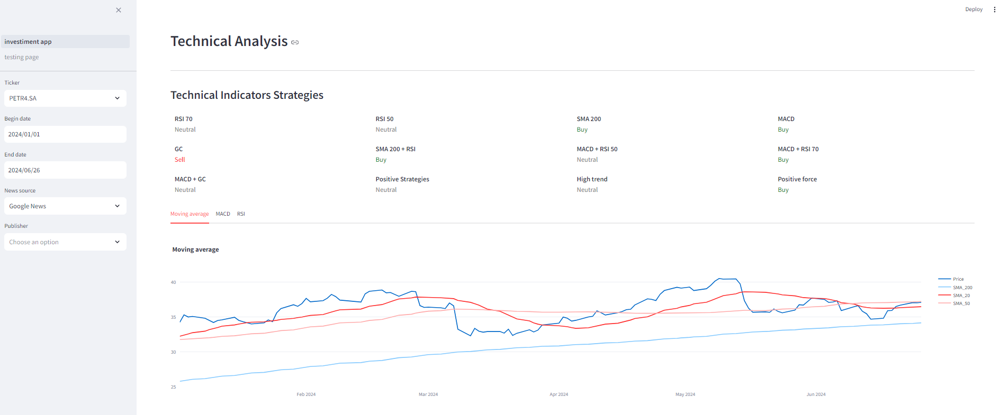

# Investiment App

> This is your all-in-one web app for comprehensive investment analysis. Designed for both novice and seasoned investors, our platform provides real-time data, in-depth market insights, and the latest financial news to help you make informed investment decisions.

### Adjustments and Improvements

The project is still under development, and the upcoming updates will focus on the following tasks:

- [ ] Add gen AI
- [ ] Add portfolio

